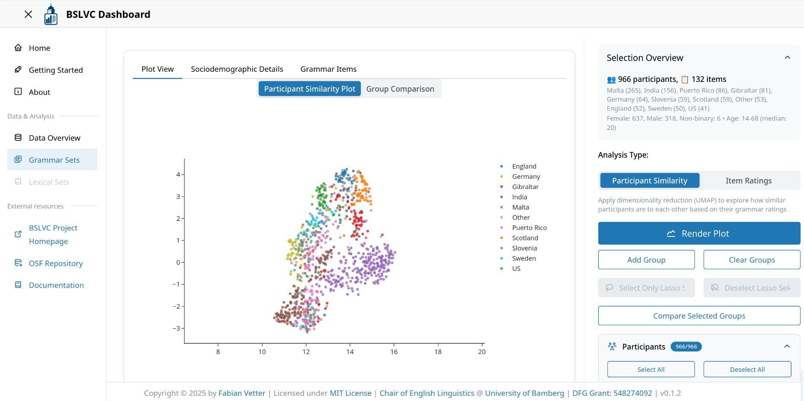
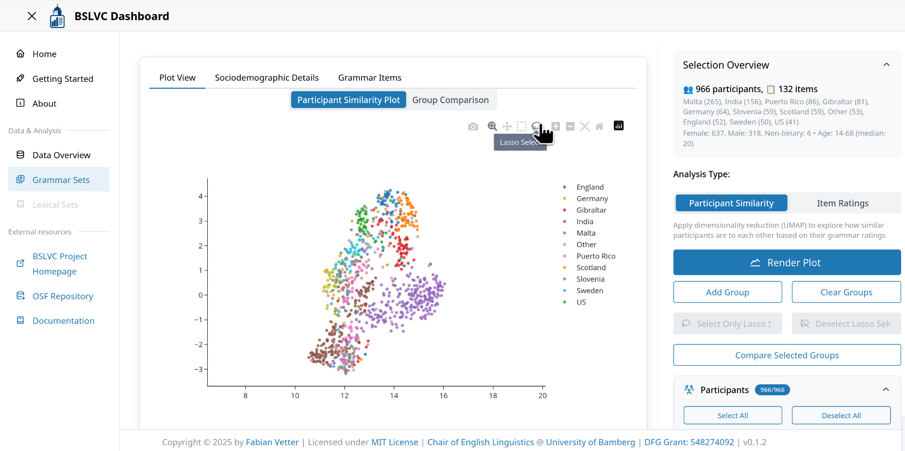

# Documentation

This document provides technical details about the BSLVC Dashboard and all available functions.

## User Interface

The user interface of the BSLVC Dashboard is structure into two or three parts, depending on the page:
- The navigation bar at the left side.
- The main window in the middle.
- The options panel in the data analysis modules.


The heart of the dashboard are the analysis modules for the grammar and the lexical data. These can be found in the section "Data & Analysis" in the navigation bar. Currently, only the grammar analysis module is finished. In what follows, you will find a description of all available options in the Dashboard.

### Data Overview

The Data Overview page provides statistical summaries and visualizations of the BSLVC dataset, including participant demographics, geographical distribution, the grammatical items, and data completeness metrics.


### Grammar Analysis Module

The Grammar Analysis Module allows users to explore grammatical variation across different varieties of English through interactive visualizations and statistical analyses.



#### Grammar Functions

Below is a description of all major buttons and UI elements in the Grammar Sets module:

#### Main Tabs
- **Plot View**: Shows either the dimensionality reduction plot and the group comparison plot, or item ratings plot.
Note: The group comparison plot uses the same settings that were used for the dimensionality reduction. Any changes that have been applied to the settings in the UI are not taken into account. This is to ensure that the group comparison is linked to the dimensionality reduction plot.
- **Sociodemographic Details**: Displays participant information and summary plots. These plots update automatically upon changing settings in the UI.
- **Grammar Items**: Shows a table of all grammar items and metadata. This table supports dynamic filtering, and can also be used for modifying the selected items in the grammar items tree.

#### Analysis Type Selector
This switch controls the analysis mode. Users can choose between "Participant Similarity" and "Item Ratings" plots. 

In the mode "Participant Similarity", the dashboard applies dimensionality reduction to the selected data using Uniform Manifold Approximation and Projection (UMAP; https://umap-learn.readthedocs.io/en/latest/). Additionally, users can compare groups in the plot. This can be done either by selectively hiding varieties, or by using the lasso tool to create custom groups. For detailed instructions, see the instructions for [custom group comparison](#custom-group-comparison).

In the mode "Item Ratings", users can compare the ratings of specific features. This mode is best suited for the comparison of a relatively small number of features. Some plot modes have limits of how much items and varieties can be displayed. Should you hit such a limit, the dashboard issues a warning notification. 

#### Primary Action
- **Render Plot**: Main button to generate the selected plot.

#### UMAP Group Buttons (visible in "Participant Similarity" mode)
These buttons facilitate custom group comparisons or excluding outliers from the selection. They all require a lasso selection of data points via the lasso tool in the mode bar at the top of the participant similarity plot as input. 

The "Add Group" and "Clear Group" buttons override the default variety-based grouping of the "Compare Selected Groups" function. More detailed instructions can ben found in the section [custom group comparison](#custom-group-comparison).

The "Deselect Lasso Selection" and "Select Only Lasso Selection" buttons modify the selection in the participants tree. These functions are helpful for deselecting outliers visible in the dimensionality reduction.

- **Add Group**: Add a group of participants for comparison.
- **Clear Groups**: Remove all defined groups.
- **Select Only Lasso Selection**: Select only participants currently selected via lasso tool.
- **Deselect Lasso Selection**: Deselect participants selected via lasso tool.
- **Compare Selected Groups**: Render a Random Forest plot comparing selected groups.

#### Participant Selection
Participants can be selected via the participant tree, either by clicking the checkboxes in the tree, by using presets or by using the buttons. Additionally, users can use the "Advanced Filters" section to select participants based on their sociodemographic details.  

- **Select All**: Select all participants in the tree.
- **Deselect All**: Deselect all participants.
- **Quick Selection**: Batch select by variety, age, gender, completeness, or balanced groups. Available presets for common selections:

    - **ENL**: Select all L1 varieties (England, Scotland, US)
    - **ESL**: Select all L2 varieties (Gibraltar, India, Malta, Puerto Rico)
    - **EFL**: Select all EFL varieties (Germany, Slovenia, Sweden)
    - **Balanced**: Select a balanced sample across all varieties
    - **Age Groups**: Select participants from specific age groups
    - **Gender**:
        - Female: Select all female participants
        - Male: Select all male participants
        - Balanced: Select a gender-balanced sample across all varieties
        - Balanced per Variety: Select a gender-balanced sample within each variety
    - **Missing values**: Select participants with 0%, <5% or <10% of missing values

- **Advanced Filters**: Filter participants by gender, age, variety ratio, and main variety.
- **Apply Filters**: Apply selected participant filters. This overrides the current selection in the participant tree.

#### Grammar Item Selection
All grammar items can be selected in the grammar items tree. They are first grouped by mode, then by feature group. Items can be either selected by clicking the checkboxes, by using presets or the buttons above the tree, or via the grammar items table in the main view. The getting started section in the app describes how the grammar items table can be used for custom item selections.

- **Select All**: Select all grammar items.
- **Deselect All**: Deselect all grammar items.
- **Problematic**: Deselect problematic items. See [problematic items](#problematic-items) for more information. Currently the following items are flagged as problematic: 'M19', 'J23', 'C14' and 'A4' for use of currency; 'E22', 'D12' and 'E6' for different renderings of the item in some varieties.  
- **Select a Preset**: Multi-select dropdown for item presets (mode, feature groups, eWAVE feature groups).
- **Advanced Options**:

    - **Use item difference (spoken-written)**: Toggle to use difference between item pairs. Most items feature in the spoken and the written section of the BSLVC. These features are referred to as *twin items*. If this switch is set to true, the interface calculates the difference of the ratings for twin items (spoken - written) for each participant and uses this value for all subsequent plots. Naturally, items that feature only in the written section are excluded.
    - **Use imputed data**: Toggle between imputed and raw data. The dimensionality reduction always uses the imputed data, as UMAP cannot handle missing values. A description of the imputation process can be found in the supplementary BSLVC resources repository (https://github.com/vetterf/BSLVC-resources; available soon!). Imputation was performed with a random forest approach.
    - **Toggle Written-Only**: Toggle items which feature only in the written section.
    - **Currency/Unit**: Toggle currency/unit items.

#### UMAP Settings
- **Color**: Select coloring variable (Variety, Variety type, Gender). This setting does not trigger a rerender of the plot and can be changed after rendering the plot.
- **Distance metric**: Choose metric (Cosine, Euclidean, Manhattan).
- **Standardize participant ratings**: Checkbox to standardize ratings. Standardization is advised for use with Euclidean and Manhattan distances.
- **Use density-preserving embedding (DensMAP)**: Checkbox for DensMAP (https://umap-learn.readthedocs.io/en/latest/densmap_demo.html). By default, UMAP does not preserve densities of clusters well. DensMAP tries to preserve the density of clusters when reducing dimensionality.
- **Number of neighbours**: Slider for UMAP hyperparameter. Check the UMAP docs for more info.
- **Minimal distance**: Slider for UMAP hyperparameter. Check the UMAP docs for more info.

#### Item Plot Settings
- **Plot mode**: Select plot type for visualizing grammar items:

    - **Mean (95% CI)**: Plot mean values of features with confidence intervals
    - **Mean (95% CI - split varieties)**: Plot mean values of features with confidence intervals. Each variety is represented separately on the y-axis. This helps to avoid overplotting, but also limits how many features and items can be displayed.
    - **Diverging stacked bars**: Show the distribution of ratings for each feature in a diverging stacked barchart.
    - **Informant mean of selected features (boxplot)**: Calculates a mean rating across all selected features for each participant and displays the distribution of these means in a boxplot.
    - **Correlation matrix**: Displays a correlation matrix showing the pairwise correlations between the selected features.
    - **Missing values heatmap**: Displays a heatmap indicating the presence of missing values across the selected features.

- **Group by**: Select grouping variable (Variety, Variety type, Gender).
- **Sort by**: Sort items by mean, standard deviation, or alphabetically.

#### Group Comparison Settings
This is only available if mode is set to "Participant Similarity". These functions can be used to filter out items that fall outside a certain rating rage, or to apply standardization of the ratings before training the random forest.
- **Filter by Average Rating**: Range slider to filter items by group average.
- **Use Z-Scores**: Checkbox to standardize ratings (participant-wise) before training the random forest.

#### Advanced Actions
- **Export Data**: Download current data selection. By default, this includes all sociodemographic columns, but only the selected participants and grammar items.
- **Copy Settings**: Copy current settings to clipboard. This function converts the current settings into a base64 code and copies it to the clipboard. This code can be used to share settings with other users or save the settings in a text file for later use.
- **Paste Settings**: Paste settings from clipboard. This button takes the base64 code created with the "Copy Settings" function to restore settings.
- **Save Settings**: Save current settings locally. Helpful for temporarily saving the settings.
- **Restore Settings**: Restore previously saved settings with the "Save Settings" function.

#### URL Parameters

The dashboard currently supports one URL parameter for controlling regional mapping participants:
- `regional_mapping=true`: When set to true, participants from England are divided into England_North, England_South and England_UNCLEAR.

You can activate this function by adding `?regional_mapping=true` to the URL (e.g., open the grammar analysis module with the following URL: https://bslvc.eng-ling.uni-bamberg.de/grammar?regional_mapping=true)

#### Custom Group Comparison

Custom group comparison allows you to compare groups of participants beyond the default variety-based grouping. This is particularly useful for analyzing subgroups or excluding outliers. You should select at least two groups. Newly added groups will be indicated with symbols. Data points that are hidden by clicking on the variety names in the plot legend will not be taken into account when groups are compared.

**How to create custom groups:**

1. Render a UMAP plot with your desired participants and settings
2. Use the lasso tool in the plot's mode bar to select a group of participants


3. Click "Add Group" to save the selected participants as a group

4. Repeat steps 2-3 to add additional groups (if desired)
5. Click "Compare Selected Groups" to generate a Random Forest comparison plot

**Important notes:**

- Custom groups override the default variety-based grouping
- The Random Forest comparison uses the same settings (participants, items, imputation) as the UMAP plot
- Use "Clear Groups" to reset and return to variety-based grouping
- The "Deselect Lasso Selection" and "Select Only Lasso Selection" buttons can be used to refine your participant selection by excluding outliers visible in the UMAP plot

#### Problematic Items

Some grammar items have been flagged as problematic due to various issues that may affect analysis results:

**Currency/Unit Items:**
- 'M19', 'J23', 'C14', 'A4': These items involve currency or unit measurements that may vary by region. An overview which item was used in which version of the questionnaire can be found in the BSLVC resources repo (https://github.com/vetterf/bslvc-resources; coming soon).

**Rendering Issues:**
- 'E22', 'D12', 'E6': These items have different renderings in some varieties:

E22: *This is exactly that I wanted*. Our Swedish speaker autocorrected this item to *This is exactly what I wanted*, effectively turning this into a control item. All other varieties are unaffected.

D12: *I'll tell Jane when I meets her*. Our Scottish speaker aspirates the *ts* in *meets* heavily, thus somewhat blurring the line between the standard use *when I meet her* and the non-standard *when I meets her*.

E6: *I'm learning French, because is a beautiful language*. Again the rendering by our Scottish speaker blurs the line between non-standard *is* and *it's*.

The "Problematic" button in the Grammar Item Selection section automatically deselects these items. Users should be aware of these issues when interpreting results that include these items.

### Lexicon Analysis Module

The Lexicon Analysis Module is currently under development. This module will provide tools for exploring lexical variation across English varieties.

## Caching System

The BSLVC Dashboard implements a multi-layered caching strategy to optimize performance and reduce computation time for expensive operations. The caching system consists of three levels: server-side disk cache, in-memory Python cache, and browser-side storage.

### Server-Side Disk Cache

The dashboard uses **DiskCache** (via the `diskcache` library) for persistent storage of computationally expensive plot objects.

#### UMAP Plot Caching

UMAP (Uniform Manifold Approximation and Projection) computations are expensive and are cached based on input parameters:

**Cache Key Components:**
- Participant list (sorted)
- Item list (sorted)
- UMAP hyperparameters (n_neighbours, min_dist, distance_metric)
- Standardization flag
- DensMAP flag
- Pairs mode flag
- Regional mapping flag

Cache keys are hashed using MD5 to create unique identifiers.

#### Random Forest Plot Caching

Random Forest comparison plots are also cached.

**Cache Invalidation:**
- Disk cache persists between sessions
- Cache is stored indefinitely (no expiration)
- Manual cache clearing requires deleting the cache directory

### In-Memory Python Cache (LRU)

The dashboard uses Python's `functools.lru_cache` decorator for in-memory caching of frequently accessed data.
LRU (Least Recently Used) cache automatically evicts the least recently accessed items when the cache is full.

### Browser-Side Storage (Dash dcc.Store)

The dashboard leverages Dash's `dcc.Store` component for client-side data persistence with three storage types:

#### Memory Storage

Temporary storage cleared when page is refreshed:

```python
dcc.Store(id="UMAPgroup", storage_type="memory", data=0)
dcc.Store(id="UMAPparticipants", storage_type="memory", data=[])
dcc.Store(id="UMAPitems", storage_type="memory", data=[])
dcc.Store(id="UMAPGroupsForRF", storage_type="memory", data={"dataframe": ...})
dcc.Store(id="grammar_plots_UMAP", storage_type="memory", data=None)
dcc.Store(id="grammar_plots_item", storage_type="memory", data=...)
dcc.Store(id="leiden-cluster-data", storage_type="memory")
dcc.Store(id="umap-hoverinfo-store", storage_type="memory")
dcc.Store(id="umap-render-trigger", storage_type="memory")
dcc.Store(id="umap-render-settings", storage_type="memory")
dcc.Store(id="clipboard-settings-store", storage_type="memory")
```

**Use Cases:**
- Current UMAP group selections
- Active participant/item selections
- Plot data for current session
- Clustering results
- Temporary UI state

#### Session Storage

Persists across page refreshes within the same browser tab/window:

```python
dcc.Store(id="last-rendered-item-plot", storage_type="session")
dcc.Store(id="last-rendered-umap-plot", storage_type="session")
dcc.Store(id="last-sociodemographic-settings", storage_type="session")
```

**Use Cases:**
- Last rendered plots (survive page refresh)
- Sociodemographic plot settings
- Session-specific cache

#### Local Storage

Persists across browser sessions (stored in browser's localStorage):

```python
dcc.Store(id="saved-item-settings", storage_type="local")
dcc.Store(id="saved-umap-settings", storage_type="local")
```

**Use Cases:**
- User-saved settings
- Persistent user preferences
- Long-term storage across sessions

### How Caching Layers Work Together: UMAP Plot Rendering

When a user requests a UMAP plot, the three caching layers work in concert to minimize computation time. Here's the complete workflow:

#### Step 1: User Interaction
User selects participants, items, and UMAP settings (neighbors, distance metric, etc.), then clicks "Render Plot".

#### Step 2: Data Retrieval (LRU Cache)

**LRU Cache Role:**
- `get_grammar_data_cached()` checks if full grammar dataset is already in memory
- If **cache hit**: Returns data from memory
- If **cache miss**: Queries SQLite database, stores result in LRU cache
- Subsequent requests with same `regional_mapping` parameter use cached data

#### Step 3: UMAP Computation (DiskCache)

**DiskCache Role:**
- Checks if this **exact combination** of parameters was computed before
- If **cache hit**: Loads pre-computed plot from disk
- If **cache miss**: Computes UMAP, saves to disk
- Cache persists across application restarts

**Why cache UMAP plots?**
- UMAP computation is extremely expensive (5-30 seconds)
- Plot objects are large (serialized Plotly figures with all trace data)
- Many possible parameter combinations (participants × items × settings)
- Results are deterministic - same inputs always produce same plot
- Persistence across sessions is valuable (users often revisit the same views)

#### Step 4: Browser Storage (dcc.Store)

**Browser Storage Role:**
- Stores the most recent UMAP plot data in browser's sessionStorage
- When user switches between "Participant Similarity" and "Item Ratings" views, the last rendered plot is restored instantly
- Survives page refreshes within the same browser session

**Why Browser Storage?**
- Instant restoration when switching plot types
- No server round-trip or re-rendering needed
- Session-specific (different tabs maintain independent state)

**Important Note:** This only restores plots when switching between plot types in the same session, not when switching browser tabs or windows. The plot must be re-rendered if the page is refreshed or the application is reopened.

---

**Last Updated**: November 2025  
**Version**: 0.1.2
